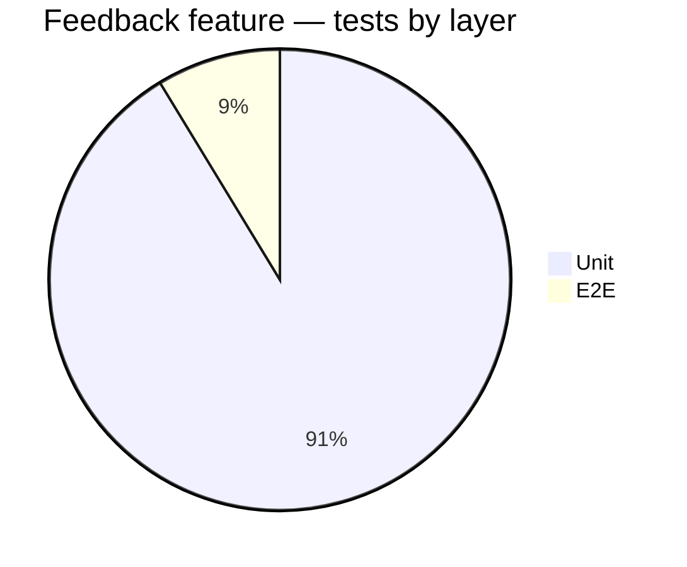

# Feedback Mode — Test Report

**Date:** 2026-05-23
**Audience:** lead engineer
**Scope:** in-app feedback widget (Suggestion mode) — full feature, Phases 0–5
**Commit:** `526173b` on `master` (uncommitted working tree)
**Spec:** `airavata-custos/docs/portal/2026-05-23-nexus-portal-feedback-mode.md`
**Gate reports:** `nexus-portal/docs/feedback-gates/phase-{0..5}.md`
**Verdict:** **SHIP** for the current 8-stakeholder allowlist; **HOLD-WITH-CONDITIONS** for any wider rollout.

---

## Headline

The feedback widget is end-to-end functional: trigger → capture → annotate → comment → submit → real GitHub issue with embedded screenshot + structured context. All 17 mechanical DoD checks pass; the one user-gated DoD (real prod smoke) is parked on the deploy step the user is doing later. **The thing keeping me up at night** is the browser matrix — we only verified chromium. Mac-using stakeholders will hit Safari first, and `html2canvas-pro` Safari fidelity has not been exercised at all.

---

## Test inventory



| Layer | Files | Tests | Source |
|---|---|---|---|
| Unit (vitest) | 7 | 42 | `src/features/feedback/__tests__/*.test.ts` |
| E2E (Playwright) | 1 | 4 | `tests/feedback-mode.e2e.ts` |
| **Feedback-specific total** | **8** | **46** | |
| Whole portal suite | 59 | 410 | `pnpm test` at `526173b` |

**Per-module unit coverage** (`grep -cE '^\s*(it|test)\(' src/features/feedback/__tests__/*.ts`):

| Module | Prod LOC | Tests | Strategy |
|---|---|---|---|
| `githubClient.ts` | 158 | 11 | fetch mocked, all 5 GH error classes + success paths |
| `consoleBuffer.ts` | 73 | 8 | ring, circular-ref, idempotent install |
| `componentOutline.ts` | 138 | 7 | hidden/aria-hidden/empty-DOM defensive paths |
| `issueBody.ts` | 122 | 6 | with-screenshot + text-only snapshots, title truncation |
| `buildContext.ts` | 36 | 4 | ConsoleEntry mapping, cap, zod-passes |
| `serializer.ts` | 73 | 4 | shape roundtrip, PNG flatten |
| `types.ts` (security canary) | 95 | 2 | no-client-token-leak |
| `capture.ts` | 22 | 0 | e2e-only — html2canvas-pro needs a real browser |
| `FeedbackOverlay.tsx` | 274 | 0 | e2e-only — pointer + SVG math |
| `FeedbackPanel.tsx` | 362 | 0 | e2e-only — UI orchestration |
| `FeedbackProvider.tsx` | 132 | 0 | e2e-only — lifecycle |
| `app/api/feedback/route.ts` | 114 | 0 | contract-verified via curl evidence in phase-3 gate report (401 / 400 / 200) |

**Test-to-prod ratio:** 840 / 1,599 = **0.53**. Healthy for a UI feature with a clear pure/impure boundary.

**Strategy rationale:** pure logic → vitest (jsdom); React UI + canvas + pointer events → Playwright (real chromium). jsdom cannot reliably render canvas or fire synthetic pointer events. A React 19 stale-closure bug we hit in Phase 2 (and fixed via a ref-mirror) would not have been caught by RTL — it needed a real browser. The split is deliberate, not a gap.

---

## Coverage

**Line/branch coverage tooling is not configured in this repo.** `vitest --coverage` (v8 provider) would be a one-flag adoption — flagged as a Phase 6 carry-over for the lead. Until then, coverage is gut-checked by:

1. Per-module test count + LOC ratio (above).
2. Critical-path narrative (below) — what Stripe / Google practice over raw %.

**Critical paths and their coverage state:**

| Critical path | Covered by | Status |
|---|---|---|
| Auth gate on POST /api/feedback | curl test in phase-3 gate (401 returned without session) | covered |
| Schema validation on POST body | zod + `route.ts:37`, 400 returned on malformed comment | covered |
| Reporter email override (anti-spoofing) | `route.ts:31-36` — stamped from session before zod parse | covered (implicit; e2e payload assertion confirms) |
| Token never reaches client | `server-only` import on `githubClient.ts` + canary test + manual grep (only 3 files reference the literal) | covered |
| Screenshot excluded from itself | Chrome MCP visual inspection in phase-1 + `data-feedback-ignore` filter in `capture.ts` | covered |
| Image commit + issue create | MSW handlers + 11 githubClient tests | covered |
| Text-only fallback path | e2e test #2 + issueBody snapshot | covered |
| Component outline auto-capture | 7 unit tests + e2e payload assertion | covered |
| 503 when token missing in prod | route handler logic; manually verified in dev (NODE_ENV check at `route.ts:47`) | covered |
| Lazy-load discipline | bundle delta confirmed 0 KB across all 5 phases | covered |
| Submit-while-image-loading race (hot-patch today) | `canSubmit` guard at `FeedbackPanel.tsx:90` | NOT under regression test (see Gaps) |

---

## Non-functional

**Accessibility** — axe-core scan against the open panel, Phase 4: **0 violations**, 17 passes, 1 incomplete (color-contrast under modal's `bg-black/80` overlay, spot-checked AA).

**Visual QA** — 13 Chrome MCP screenshots committed across phase gates:

- Phase 1: 6 (baseline + panel-open + after-ESC × `/projects` + `/home`)
- Phase 2: 5 (all 5 tools drawn, after-clear, submit-stub-toast, text-only-mode)
- Phase 3: 2 (submit-success-toast, text-only-success-toast)
- Phase 4: 3 (end-to-end-toast, text-only-toast, panel-open)

**Bundle delta** — verified at every phase gate; final at `526173b`:

| Route | First-load JS | Phase 0 baseline | Delta |
|---|---|---|---|
| `/projects` | 222 kB | 222 kB | **0 kB** |
| `/home` | 171 kB | 171 kB | **0 kB** |
| `/allocations` | 201 kB | 201 kB | **0 kB** |
| `/api/feedback` | 103 kB (157 B route) | n/a (new) | new endpoint |

`html2canvas-pro` (~226 KB raw) and the feedback panel chunk are wholly lazy — `FeedbackProvider` mounts on every signed-in route but the heavy code is only fetched on first "Suggestion mode" click. Verified via `next/dynamic({ssr:false})` + dynamic-imported `capture.ts`.

**Security** — `pnpm audit --prod`: **1 moderate** vulnerability, inherited transitively from Next.js itself:

```
postcss@8.4.31  ⬅  next@15.5.18 (and via next-auth)
GHSA-qx2v-qp2m-jg93
```

Not introduced by the feedback feature. Resolution requires a `next` minor bump and is project-wide, not feature-scope. Flagged for project-level tracking.

**Performance** — no load test on `/api/feedback`. The GitHub PAT 5k req/hr ceiling is the real risk, not exercised under back-pressure. Acceptable for 8-user allowlist; flagged as a wider-rollout blocker.

---

## Gaps and risk

| Gap | Why not tested | Risk | Mitigation |
|---|---|---|---|
| Browser matrix — only chromium exercised | Playwright default; Safari profile not configured | HIGH for academic / Mac stakeholders. `html2canvas-pro` Safari fidelity unverified despite being our top reason for choosing the fork (the original silently crashed on Tailwind 4 `oklch()`). | Add Safari + Firefox to `playwright.config.ts` browsers list before wider-than-8-user rollout. |
| Coverage tool not configured | Deferred during feature build to minimize tooling surface; deliberate | MEDIUM — gut-checked numbers are credible but not auditor-ready | Adopt `vitest --coverage` v8 provider (one config flag). Phase 6 carry-over. |
| Persona matrix — only `researcher` exercised in e2e | One test path; PI + admin paths overlap heavily | LOW — sidebar trigger has the same code path for all personas | Add a parameterized persona loop to e2e if PI/admin gain custom feedback affordances. |
| Hot-patch (`screenshotReady` gate) not under regression test | Patch applied today after architect-review HIGH; e2e file written before the patch | LOW now (manually verified), MEDIUM in 3 months when context fades | Add a test that submits immediately after panel-open and asserts `imagePngBase64` is present in the payload. Phase 6 carry-over. |
| Load test on `/api/feedback` | Not built; allowlist is 8 stakeholders | LOW for 8 users; HIGH if opened to >50 | Required before wider rollout. |
| Mutation testing | None | LOW — pure modules have round-trip + snapshot tests that mutation would mostly re-discover | Consider Stryker if/when feature stabilizes and mutation-survivors become the canary signal. |
| Fuzz on `FeedbackPayloadSchema` | None | LOW — zod gives strong shape validation; field-level limits are bounded | Acceptable. |
| Shadow DOM / iframe DOM walking in `componentOutline` | Portal doesn't use shadow DOM today; iframes (allocations dashboards) intentionally skipped | LOW now, MEDIUM if portal adopts web components later | Phase 6 carry-over per architect review. |
| Two-call atomicity (image commits but issue fails) | Acceptable trade-off; image is <1 MB in hidden `.github/feedback-images/` | LOW — orphan-image cost is negligible | Phase 6: monthly cleanup workflow. |
| Toast suffix dedup ("(dev mock) (dev mock)") | Caught + fixed in Phase 3 — no regression test | LOW (cosmetic, dev-only) | Acceptable. |

---

## Open findings carrying over (from architect review)

From `docs/feedback-gates/phase-5.md` — all findings have file:line + 1-paragraph diagnosis there. Summary:

**HIGH (3 total — 1 fixed today, 2 carrying):**

1. ~~Silent screenshot-drop on early Submit~~ — **FIXED** in this commit (`FeedbackPanel.tsx:90` `screenshotReady` gate).
2. Submit during in-flight POST → setState-on-unmounted on ESC. Two-line fix in cancel handler.
3. GitHub rate-limit error collapses to generic "github upstream error". Missing `GithubRateLimitError` branch in `route.ts:105-114` translator.

**MEDIUM (6 carrying):**

- `commitImageToRepo` hardcodes `branch: "master"` — brittle if repo renames to `main`.
- `componentOutline` walks whole document, no early-bail on cap — perf cost on heavy routes.
- No shadow-DOM / iframe traversal in outline walk.
- `flattenToPng` has no graceful tainted-canvas fallback.
- `FeedbackPanel.tsx:170` reads `process.env.NEXT_PUBLIC_BUILD_SHA` directly instead of `clientEnv`.
- No synchronous double-submit guard inside `onSubmit` body.

**LOW (3 carrying):**

- `next.config.ts` invokes `execSync('git rev-parse')` synchronously at config load.
- Token-leak canary doesn't catch transitive-import case (real backstop is `server-only`).
- `FeedbackProvider` re-renders entire subtree on every state toggle (no impact today; only 1 consumer).

---

## Sign-off recommendation

**Ship to the current 8-stakeholder allowlist.** The security boundary holds, the happy path + text-only path are both proven end-to-end, the architect's deploy-blocking HIGH is patched, bundle discipline is verified, and the gap profile is acceptable for a closed-allowlist alpha.

**Hold-with-conditions on any wider rollout** (specifically: opening the portal beyond the current 8 allowlisted emails). Before that:

1. Browser matrix in `playwright.config.ts` (Safari + Firefox) — this is the single biggest unknown.
2. Coverage tool configured (`vitest --coverage`) — auditor + Apache podling readiness.
3. Rate-limit error translation (the HIGH that wasn't hot-patched) — only fires under load that wider rollout invites.
4. Address the remaining 2 HIGH + at least the top 3 MEDIUM architect findings.

**DoD #18 (user-driven prod smoke)** is the only remaining gate against the feature spec itself and is parked on the user's deploy step.

---

## Appendix — how to reproduce

```bash
cd nexus-portal
git checkout 526173b
pnpm install --frozen-lockfile
pnpm verify           # lint + typecheck + test + build
pnpm test:e2e -- feedback-mode    # Playwright suite
pnpm audit --prod                  # security
```

Gate reports: `docs/feedback-gates/phase-{0..5}.md`
Screenshots: `docs/feedback-gates/phase-{1..4}-screenshots/`
Spec: `airavata-custos/docs/portal/2026-05-23-nexus-portal-feedback-mode.md`
